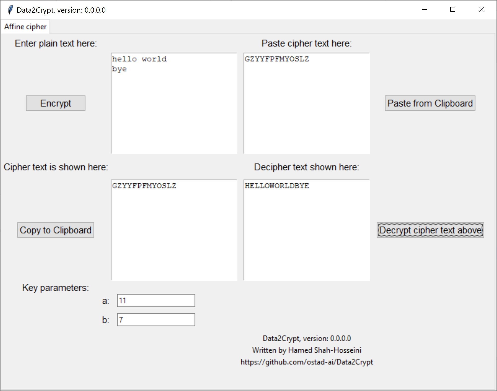

# Data2Crypt
### Newest: version 0.0.0.3
1. Bifid cipher is now availabe.
2. We can use numbers besides alphabets in plaintexts.
## This archive includes the executable program, data2crypt.exe, which you should click on to run.
[Download the archive for win64](https://drive.google.com/file/d/1WRBN-iah5LPHS7IDdiHMbSQmr2LFJYkw/view?usp=sharing)
---
### Earlier version 0.0.0.2
1. Hill cipher has been included now.
2. We can generate a key for this cipher by the button provided.
---
### Earlier version 0.0.0.1
1. Vigenere cipher has been included.
---
### Earlier Version 0.0.0.0
1. Encryption and decryption by Affine cipher.
---
 *Figure 1: A snapshot of Data2Crypt for Affine cipher.*
---
2. An example of Vigenere cipher.
---
 *Figure 2: A snapshot of Data2Crypt for Vigenere cipher.*
---
3. An example of Hill cipher.
---
 *Figure 3: A snapshot of Data2Crypt for Hill cipher.*
---
4. An example of Bifid cipher.
---
 *Figure 4: A snapshot of Data2Crypt for Bifid cipher.*
---